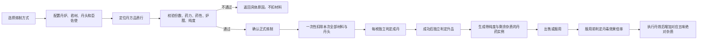

# 炼丹系统
炼丹的系统边界与术语、一炉的构成、枚举与序列、状态机与总流程、配置数据源与跨表引用、加载索引与校验、草稿与硬条件、结算公式、正式炼制与产物、服用与丹毒、错误键、取整与边界总表。数值以炼丹相关配置表为准。

## 职责划分
权威结算层负责：配置校验、丹方定位、数值计算、库存与神识复核、扣料、随机判定、产物与配方存档、服用与丹毒事务。
前台负责：提交输入、请求预览、展示权威结果。

预览与正式炼制使用**同一套无状态计算**。正式操作时重新读取当前配置、角色、技能、库存和丹炉；前台传来的药力、纯度、概率、售价等派生值**不是权威输入**，一律重算。
实际类名、文件组织和序列化形式由程序按项目架构确定。

## 一炉的构成
每炉固定投入：**一份君材、一个丹头**，以及**至少一份臣材、至少一份使材、零至多份佐材**。
| 材位 | 数量 | 职责 |
|---|---|---|
| 君材 | 每炉固定 1 份 | 决定本炉境界、基础品质和药力门槛；其药性构成开炉初值 |
| 丹头 | 每炉固定 1 个 | 给出臣佐使最大承药份数；可作为特殊丹方凭证 |
| 臣材 | ≥1 份 | 决定丹药作用（五行） |
| 使材 | ≥1 份 | 决定丹药作用部位（五味），并决定服药入哪个丹毒池 |
| 佐材 | 0..N 份 | 补药力、调药性 |

**丹头不参与药力、药性、绝对杂质求和**，但**随炉消耗**（见 「扣料范围」）。

## 枚举与序列
**项目统一境界序列**（序号自 0 起，程序按此计算境界差）：
```text
0 炼气   1 筑基   2 金丹   3 元婴
4 化神   5 炼虚   6 合体   7 大乘
```

炼气境不开放炼丹，因此**丹方境界只取序号 1..7**（筑基至大乘，共 7 个可炼境界）。境界差计算不排除炼气，来源境界为炼气时按序号 0 参与计算。

**品质枚举 `ItemQuality`**（自低到高，序号 1..6，对应除渣力表的 `filter1..filter6`）：
```text
1 凡品   2 灵品   3 玄品   4 仙品   5 神品   6 道品
```

**五行**：金、木、水、火、土。
**五味固定映射**：
```text
酸 → 血肉    苦 → 心神    甘 → 丹田    辛 → 气脉    咸 → 骨底
```

**自由炼制主坐标**：`[realm, jun_quality, element, taste, nval]`；同一主坐标允许普通丹方与不同指定丹头丹方并存，最终按实际丹头消歧（「自由炼制定位」）。

**万分比**：`0..10000` 的整数。**全系统不使用小数**；配置表内以小数书写的参数在加载时一次性换算为万分比整数（见 「配置数据源」）。

**丹方规模**：7 可炼境界 × 5 五行 × 5 五味 × 5 档最终药性 = 875 个基础丹方坐标；每张基础丹方开放其中三个品质 → 2625 个丹方品质行。程序不硬编码这些数量，只按配置加载。

## 闭环


## 炼制状态
| 状态 | 进入条件 | 可用操作 | 扣料 |
|---|---|---|---|
| 未配置 | 打开界面、切换境界或清空草稿 | 选炉、选丹方、选材 | 否 |
| 配置中 | 草稿发生变动 | 编辑、预览 | 否 |
| 配置不通过 | 预览存在阻断项 | 查看原因、继续编辑 | 否 |
| 可正式炼制 | 全部硬条件通过且 `maxBatch ≥ 1` | 设数量、确认 | 否 |
| 正式结算中 | 服务器接受新 `requestId` | 禁用重复提交 | 事务中 |
| 结果 | 事务提交 | 看结果、返回主面板 | 已结算 |

## 总流程
创建或载入草稿 → 预览与硬条件校验 → 确认请求 → 权威重校验与一次性扣料 → 逐枚成丹、逐枚升品 → 生成丹药实例 → 服用与丹毒结算。
**任一配置阶段失败不扣料；单枚成丹失败不退该枚材料。**

## 工作簿、运行页签与查询键（一）
| 工作簿 | 运行页签（技术表ID） | 查询键 | 本表唯一保存的内容 |
|---|---|---|---|
| `L灵植表.xlsx` | `灵植表` | `id` | 君、臣、佐、使、丹头的ID、名称、境界、材位、品质及各材位固有属性 |
| `D丹方丹效表.xlsx` | `丹方表` | `id`、`recipe_id`、自由坐标 | 每个基础丹方每个开放品质的识别信息、君材品质、成丹条件、默认投料、成丹率、升品率、丹效、持续时间、参考售价 |
| `D丹方丹效表.xlsx` | `除渣力` | `[source_type, source_id]` | 炼丹术、灵植术、丹炉按来源ID与基准境界配置的六品质同境基础除渣率／过滤率 |
| `D丹方丹效表.xlsx` | `丹毒池` | `base_realm` | 各角色境界、各五味的池容量与每日消退率 |
| `D丹方丹效表.xlsx` | `成丹率描述` | `id`、闭区间 | 成丹率区间对应的前台文字 |

## 工作簿、运行页签与查询键（二）
| 工作簿 | 运行页签（技术表ID） | 查询键 | 本表唯一保存的内容 |
|---|---|---|---|
| `D丹方丹效表.xlsx` | `杂质售价` | `id`、闭区间 | 实际杂质占比对应的成色档与售价系数 |
| `D丹炉表.xlsx` | `furnace_config` | `id` | 丹炉ID、名称、最高可炼境界、品质、承寒下限、承热上限、神识门槛、价格、启用状态 |
| `X系统参数.xlsx` | `ConfigSystemVar` | `ParamID` | 低境界炼丹倍率、炼丹术熟练参数、灵植术熟练参数、丹毒效果减半线 |
| `S属性配置表.xlsx` | `attr_config` | `name` | 五味绝对杂质与丹毒、神识及丹效可操作属性的项目属性接口 |

**每项数据只有一个权威归属**：
- 丹炉的过滤率**不在丹炉表**，按丹炉 `id` 保存在 `除渣力` 表的 `source_type=丹炉` 行；
- 最低纯度、成丹率封顶纯度、最低杂质、神识要求、基础成丹率、成丹率上限、升品率、丹效、参考售价**全部保存在丹方品质行**；
- 特殊丹头关系由丹方表的 `head_id` 引用；
- 丹毒禁服线固定为 `10000`，**不设系统参数**；减半线读系统参数；容量与消退率读 `丹毒池`。

各工作簿内的「说明」「计算」「编号」「数值施工」等页签**不进入运行时**，程序不读取。

## 表头合同与通用加载规则
Luban 导表头：
| 行 | 标记 | 含义 |
|---|---|---|
| 第1行 | `##var` | 稳定技术字段名 |
| 第2行 | `##type` | 导出类型 |
| 第3行 | `##group` | 导出分组 |
| 第4行 | `##` | 中文显示名 |
| 第5行起 | — | 数据行 |
- 程序读取导表生成的数据对象，**不按中文表头、不按 Excel 列序号、不按策划整理列取值**。
- `X系统参数.xlsx` 与 `S属性配置表.xlsx` 沿用项目现有导表合同，不用新表的 `c` 分组规则反推其导出范围。
- `seq` 只用于策划排序，运行时忽略。
- 实体引用一律使用**整数ID**；名称只用于显示与检查。
- **可选整数引用必须由配置显式填写 `0`**；空单元格不等于 `0`，程序不做静默归一，遇空即报 `CONFIG_INVALID`。
- 每个丹方品质行独立完整，**不从相邻行继承空值**。
- 加载完成后的配置对象**只读**：不排序、不修正、不回写。

## 灵植表 `灵植表`（一）
| 技术字段 | 类型 | 中文表头 | 程序含义与范围 |
|---|---|---|---|
| `seq` | `int` | 序号 | 仅策划排序 |
| `id` | `int` | 灵植ID | 材料／丹头唯一ID，供丹方、库存、玩家配方引用 |
| `name` | `string` | 名称 | 检查用名称；正式显示名以物品系统为准 |
| `realm` | `string` | 境界 | 材料所属境界，须命中境界序列 |
| `role` | `string` | 分类 | 仅 `君`、`臣`、`佐`、`使`、`丹头` |
| `quality` | `string` | 品质 | 六品质枚举之一 |
| `element` | `string` | 五行[仅臣] | 仅臣材必填，金木水火土 |
| `taste` | `string` | 五味[仅使] | 仅使材必填，酸苦甘辛咸 |
| `max_material_count` | `int` | 最大承药份数[仅丹头] | 仅丹头必填，正整数；臣佐使合计份数上限 |

## 灵植表 `灵植表`（二）
| 技术字段 | 类型 | 中文表头 | 程序含义与范围 |
|---|---|---|---|
| `nval` | `int` | 性值 | 君材开炉药性或单份药性增量，范围 `−4..+4` |
| `power` | `int` | 单份药力 | 君臣佐使单份药力，非负整数 |
| `dross` | `int` | 杂质 | 君臣佐使单份绝对杂质，非负整数 |
| `target_power` | `int` | 目标药力[仅君] | 仅君材必填，正整数；本炉药力门槛 `U` |
| `price` | `int` | 价格 | 材料或丹头价格，非负整数 |
`灵植分类`、`药势`、`ID编号用` 等为策划整理列，不导出、不读取。

**各材位必填运行字段**：
| 材位 | 必填字段 |
|---|---|
| 君 | `id, realm, quality, nval, power, dross, target_power` |
| 臣 | `id, realm, quality, element, nval, power, dross` |
| 佐 | `id, realm, quality, nval, power, dross` |
| 使 | `id, realm, quality, taste, nval, power, dross` |
| 丹头 | `id, realm, quality, max_material_count` |

## 丹方表 `丹方表`
一行 = 一个基础丹方坐标的一个基础成丹品质。同一基础丹方的开放品质行共用 `recipe_id`，每行完整保存本品质的全部内容，**行间不继承空值**。

## 识别与品质（一）
| 技术字段 | 类型 | 中文表头 | 程序含义与范围 |
|---|---|---|---|
| `id` | `int` | ID | 品质行唯一主键 |
| `recipe_id` | `int` | 丹方ID | 同一基础丹方的组键 |
| `pill_name` | `string` | 正式丹名 | 本品质成品显示名 |
| `rule_name` | `string` | 规则小名 | 策划识别名 |
| `function` | `string` | 作用说明 | 白话药效说明；只作说明文字，不参与丹效结算 |
| `realm` | `string` | 境界 | 丹方境界，须命中境界序列且序号 ≥1 |
| `quality` | `ItemQuality` | 品质 | 本行直接产出的基础品质 |
| `jun_quality` | `ItemQuality` | 君材品质 | 本行要求的君材与丹头品质；**必须等于 `quality`** |
| `jump_tier_prob` | `int` | 跳档几率（万分比） | 升一品概率，`0..10000` |

## 识别与品质（二）
| 技术字段 | 类型 | 中文表头 | 程序含义与范围 |
|---|---|---|---|
| `enabled` | `bool` | 是否启用 | 是否进入运行时 |

## 坐标与成丹条件（一）
| 技术字段 | 类型 | 中文表头 | 程序含义与范围 |
|---|---|---|---|
| `element` | `string` | 臣行 | 全部臣材必须符合的五行 |
| `taste` | `string` | 使味 | 全部使材必须符合的五味，并决定服药入池 |
| `nval` | `int` | 成丹性值 | 投药结束时必须精确命中的累计药性，范围 `−2..+2` |
| `head_id` | `int` | 丹头ID | `0` = 不指定；`>0` = 必须使用该丹头 |
| `min_purity` | `int` | 最低纯度 | 本行门槛纯度 `Qmin`，万分比 |
| `rate_cap_purity` | `int` | 成丹率封顶纯度 | **本行实际可配出的最强纯度 `Qcap`**，万分比；成丹率顶格锚点 |
| `min_impurity` | `int` | 最低杂质 | 本行剩余杂质下限 `L`，正整数 |
| `base_rate` | `int` | 基础成丹率 | 纯度等于 `Qmin` 时的成丹率 `B`，万分比 |

## 坐标与成丹条件（二）
| 技术字段 | 类型 | 中文表头 | 程序含义与范围 |
|---|---|---|---|
| `max_rate` | `int` | 成丹率上限 | 纯度达到 `Qcap` 时的成丹率 `C`，万分比 |
| `spirit_requirement` | `int` | 神识要求 | 单枚并炼所需神识，正整数；用于批次上限 |

**`rate_cap_purity` 的语义**：在同境满熟练条件下，遍历本行全部合法同境材料、丹头与丹炉并计入安全投药顺序后得到的最高可达纯度。数值脚本生成该值，程序运行时直接读取；玩家条件超过标定结果时，成丹率仍封顶于`max_rate`。

## 默认投料
| 技术字段 | 类型 | 中文表头 | 程序含义与范围 |
|---|---|---|---|
| `jun_id` | `int` | 默认君材ID | 默认配方君材 |
| `jun_num` | `int` | 君材数量 | **必须为 `1`** |
| `min_id` | `int` | 默认臣材ID | 默认配方臣材 |
| `min_num` | `int` | 臣材数量 | 正整数 |
| `ast_id` | `int` | 默认佐材ID | `0` = 不投佐材 |
| `ast_num` | `int` | 佐材数量 | `ast_id = 0` 时必须为 `0`；`ast_id > 0` 时为正整数 |
| `env_id` | `int` | 默认使材ID | 默认配方使材 |
| `env_num` | `int` | 使材数量 | 正整数 |

默认配方**不保存投药顺序**，顺序由运行时搜索（见 「系统默认配方的丹头与安全顺序」）。默认配方只是教学与快捷投料，**不限制自由炼制使用其他合法材料**。当前结构每个材位只支持一种默认材料。

## 丹效与价格
| 技术字段 | 类型 | 中文表头 | 程序含义与范围 |
|---|---|---|---|
| `duration` | `int` | 持续秒数 | `0` 由行为类型解释为瞬时或永久 |
| `action1..3` | `string` | 行为1..3 | 按序执行的三个丹效槽，合法值见下 |
| `param1..3` | `string` | 参数1/ID..3/ID | 按行为填写属性名、技能ID、BUFF ID 或词条ID |
| `value1..3` | `int` | 数值1/ID..3/ID | **仅 `加属性` 读取**；其余三种行为不读取 |
| `reference_price` | `long` | 参考售价 | 本品质成品的基础参考售价，正整数 |

**丹效行为合同**（`action` 只允许这四个值）：
| `action` | `param` 填写 | `value` | 程序职责 |
|---|---|---|---|
| `加属性` | 属性名，必须命中 `attr_config.name` | 必填，本次属性变化的基础数值 | 按 「丹效执行与倍率取整」 应用效果倍率后修改属性 |
| `调用技能` | 技能ID | 不读取 | 调技能执行器，传 `param`、`effect_multiplier`、`duration` |
| `调用BUFF` | BUFF ID | 不读取 | 调BUFF执行器，传 `param`、`effect_multiplier`、`duration` |
| `调用词条` | 词条ID | 不读取 | 调词条执行器，传 `param`、`effect_multiplier`、`duration` |

`action` 为空时**整组跳过**，不读取该组的 `param` 和 `value`。三组严格按 `1 → 2 → 3` 执行。

## 丹炉表 `furnace_config`
| 技术字段 | 类型 | 中文表头 | 程序含义与范围 |
|---|---|---|---|
| `seq` | `int` | 序号 | 仅策划排序 |
| `id` | `int` | 丹炉ID | 唯一，供除渣力表引用 |
| `name` | `string` | 名称 | 显示名 |
| `max_realm` | `string` | 最高可炼境界 | 可炼丹方的最高境界 |
| `quality` | `ItemQuality` | 品质 | 丹炉品质 |
| `cold_min` | `int` | 承寒下限 | 累计药性下界 |
| `heat_max` | `int` | 承热上限 | 累计药性上界，`cold_min ≤ heat_max` |
| `spirit_requirement` | `int` | 神识门槛 | 驱动本炉所需当前神识，正整数 |
| `price` | `int` | 价格 | 非负整数 |
| `enabled` | `bool` | 是否启用 | 是否允许选择 |

**丹炉过滤率不存本表**，按 `id` 读除渣力表。丹炉不设「炉性」字段；炉膛完全由 `[cold_min, heat_max]` 表达。

## 除渣力表 `除渣力`
| 技术字段 | 类型 | 中文表头 | 程序含义与范围 |
|---|---|---|---|
| `seq` | `int` | 序号 | 仅策划排序 |
| `source_id` | `int` | 来源ID | 技能等级ID或丹炉ID |
| `name` | `string` | 名称 | 显示与检查用 |
| `base_realm` | `string` | 基准境界 | 本行基础值对应的境界 |
| `source_type` | `string` | 来源 | 仅 `技能` 或 `丹炉` |
| `filter1..filter6` | `int` | 凡至道六品 | 同境基础除渣率／过滤率，万分比 `0..10000` |
复合主键 `[source_type, source_id]`。

`filter1..filter6` 对应凡、灵、玄、仙、神、道六品，**按本次炼制的基础丹方品质行的 `quality` 取列**（升品在成丹之后执行，不回改本炉除渣结算）。

三种来源的查询入口：
```text
玩家当前炼丹术技能ID → [技能, 该ID]  → 配 参数_炼丹术熟练
玩家当前灵植术技能ID → [技能, 该ID]  → 配 参数_灵植术熟练
当前丹炉 furnace_config.id → [丹炉, 该ID] → 无熟练加成
```

`source_type = 技能` 只区分技能与丹炉，**具体是炼丹术还是灵植术由查询入口决定**，不从表里判断。

## 丹毒池表 `丹毒池`（一）
| 技术字段 | 类型 | 中文表头 | 程序含义与范围 |
|---|---|---|---|
| `seq` | `int` | 序号 | 仅策划排序 |
| `base_realm` | `string` | 基准境界 | 角色当前境界，唯一 |
| `blood_capacity` | `int` | 血肉池容量（酸） | 正整数 |
| `mind_capacity` | `int` | 心神池容量（苦） | 正整数 |
| `dantian_capacity` | `int` | 丹田池容量（甘） | 正整数 |
| `meridian_capacity` | `int` | 气脉池容量（辛） | 正整数 |
| `bone_capacity` | `int` | 骨底池容量（咸） | 正整数 |
| `blood_daily_decay` | `int` | 血肉丹毒消退（酸） | 每游戏日按本池容量消退的万分比 `0..10000` |
| `mind_daily_decay` | `int` | 心神丹毒消退（苦） | 同上 |

## 丹毒池表 `丹毒池`（二）
| 技术字段 | 类型 | 中文表头 | 程序含义与范围 |
|---|---|---|---|
| `dantian_daily_decay` | `int` | 丹田丹毒消退（甘） | 同上 |
| `meridian_daily_decay` | `int` | 气脉丹毒消退（辛） | 同上 |
| `bone_daily_decay` | `int` | 骨底丹毒消退（咸） | 同上 |

五味 → 池 → 属性映射：
| 五味 | 作用域 | 绝对杂质属性 | 丹毒属性 | 字段前缀 |
|---|---|---|---|---|
| 酸 | 血肉：筋骨、气血与肉身损伤 | 血肉杂质 | 血肉丹毒 | `blood` |
| 苦 | 心神：神识及泄浊 | 心神杂质 | 心神丹毒 | `mind` |
| 甘 | 丹田：修为与境界结构 | 丹田杂质 | 丹田丹毒 | `dantian` |
| 辛 | 气脉：灵力运行与战斗回路 | 气脉杂质 | 气脉丹毒 | `meridian` |
| 咸 | 骨底：肉身根基、寿元与灵根 | 骨底杂质 | 骨底丹毒 | `bone` |
**五味使用完全独立的池，各自走各自的时间线。**

## 成丹率描述表 `成丹率描述`
| 技术字段 | 类型 | 中文表头 | 程序含义与范围 |
|---|---|---|---|
| `id` | `int` | ID | 区间唯一ID |
| `min_rate` | `int` | 最小成丹率 | 闭区间下界 |
| `max_rate` | `int` | 最大成丹率 | 闭区间上界 |
| `text` | `string` | 前台提示 | 成丹率提示文字 |

程序按 `min_rate ≤ R ≤ max_rate` 查唯一提示。区间**不重叠、无空隙，并集必须恰好覆盖 `1..10000`**。

配合 「加载校验」 校验「`base_rate ≥ 1`」，运行期的 `R` 恒落在 `1..10000` 内，因此**永远能查到文字**。

## 售价接口
`杂质售价`使用`id/name/min_g/max_g/price_factor`。六行闭区间连续、无重叠并恰好覆盖`0..10000`；`price_factor`为万分比且随`G`升高严格递减。`QuoteSale(G, reference_price)`按「售价」返回实际售价。

## 系统参数 `ConfigSystemVar`
| 技术字段 | 类型 | 中文表头 | 程序含义 |
|---|---|---|---|
| `ConfigID` | `int` | 配置ID | 表内稳定ID |
| `ParamID` | `string` | 参数名 | 程序查询键 |
| `ParamValue` | `string` | 参数值 | 按下表的参数合同解析 |

炼丹使用的四个参数**必须存在**，缺一即 `CONFIG_INVALID`：
| `ParamID` | 参数合同 | 程序用途 |
|---|---|---|
| `参数_低境界炼丹` | 书写为不小于 `1` 的倍率；**加载时一次性换算为万分比整数 `K_bp = round(值 × 10000)`**，校验 `K_bp ≥ 10000`，运行期只使用 `K_bp` | 三种除渣来源炼制低于自身基准境界的丹方时的**逐境倍率** |
| `参数_炼丹术熟练` | 万分比整数 / 每 1% 熟练度 | 炼丹术每提高 1% 熟练度，乘入其基础除渣率的增幅 |
| `参数_灵植术熟练` | 万分比整数 / 每 1% 熟练度 | 灵植术每提高 1% 熟练度，乘入其基础除渣率的增幅 |
| `参数_效果减半丹毒` | 万分比整数 `0..10000` | 服药前对应丹毒达到该值时，本枚药效倍率为 `5000` |
**丹毒禁服线固定为 `10000`，不配置系统参数、不可改。**

除以上四个参数外，炼丹系统不读取任何其他 `ParamID`。丹炉的可炼范围、炉膛、过滤率**全部来自丹炉表与除渣力表**，不来自系统参数。

## 属性配置表 `attr_config`
| 技术字段 | 类型 | 程序含义 |
|---|---|---|
| `config_id` | `int` | 属性配置ID |
| `name` | `AttrKey` | 程序访问属性的键；丹效 `加属性` 的 `param` 必须命中此值 |
| `role` | `AttrRole` | 属性角色；炼丹相关属性为 `BASE` |
| `parent_attr_modifier` | `array,AttrModifier` | 父属性影响配置 |
| `tab` | `string` | 前台分组 |
| `desc` | `string` | 属性说明 |
| `is_show` | `bool` | 是否显示在装备栏 |
| `is_show_tip` | `bool` | 是否显示在属性提示中 |

炼丹必须存在的属性：
| `AttrKey` | 类型 | 程序职责 |
|---|---|---|
| 血肉杂质、心神杂质、丹田杂质、气脉杂质、骨底杂质 | 整数 | 五味池当前**绝对杂质 `I`**，角色存档值 |
| 血肉丹毒、心神丹毒、丹田丹毒、气脉丹毒、骨底丹毒 | 万分比 | **派生值 `T`**，由 `I` 与当前境界池容量算出，不单独存档 |
| 神识 | 整数 | 丹炉准入与批次上限的输入 |
丹效 `加属性` 所引用的全部属性名也必须存在于本表。

## 跨表引用总图
```text
丹方表.jun_id / min_id / ast_id / env_id / head_id  → 灵植表.id
丹方表.realm                                        → 境界序列
丹方表.quality / jun_quality                        → ItemQuality（且二者相等）
丹方表.action*.param（加属性）                       → attr_config.name
furnace_config.id                                   → 除渣力[丹炉, source_id]
玩家当前炼丹术/灵植术技能ID                          → 除渣力[技能, source_id]
角色当前境界                                        → 丹毒池.base_realm
结算得到的 R                                        → 成丹率描述[min_rate, max_rate]
```

## 运行时索引
加载成功后建立只读索引：
```text
herbById[id]
recipeRowById[id]
recipeRowsByRecipeId[recipe_id]          按 ItemQuality 升序排列
recipeRowsByCoordinate[realm, jun_quality, element, taste, nval]  按 head_id 建子索引
furnaceById[id]
removalBySource[source_type, source_id]
poisonPoolByRealm[base_realm]
rateTextByRange                          成丹率描述区间索引
systemVarByParamId[ParamID]
attrByName[name]
```

## 加载校验
任一校验失败时，日志**必须包含**：工作簿、页签、行ID、字段ID、原值、错误键。相关内容不可开放；致命全局错误关闭炼丹入口并对前台返回 `CONFIG_INVALID`。

**结构与引用**
1. 所有运行主键唯一（含除渣力复合键）；所有引用ID存在且类型为整数。
2. 所有字段满足 「配置数据源」 的导出类型、枚举、范围；可选整数引用只接受**显式 `0`**，空单元格即失败。
3. `realm` 必须命中境界序列；丹方 `realm` 序号必须 ≥1。
4. 同一启用品质行的 `[realm, jun_quality, element, taste, nval, head_id]` 唯一；同一主坐标最多存在一条 `head_id=0` 普通行，但允许存在多条 `head_id>0` 且丹头不同的专用行。
5. 丹方 `quality = jun_quality`。

**范围与单调·其一**
6. `0 ≤ jump_tier_prob ≤ 10000`。
7. **`1 ≤ base_rate ≤ max_rate ≤ 10000`**（下界为 `1`，保证 `R ≥ 1`）。
8. **`0 ≤ min_purity < rate_cap_purity ≤ 9999`**（分母恒正；`9999` 上界来自 `min_impurity ≥ 1` 使纯度不可能达到 `10000`）。
9. `min_impurity ≥ 1`；`spirit_requirement ≥ 1`（丹方与丹炉均是）；丹头 `max_material_count ≥ 1`；毒池容量为正整数。

**范围与单调·其二**
10. `cold_min ≤ heat_max`。
11. 材料 `nval ∈ [−4, +4]`；丹方 `nval ∈ [−2, +2]`；`power ≥ 0`；`dross ≥ 0`；君材 `target_power ≥ 1`。
12. 三种来源的 `filter1..filter6` 均在 `0..10000`，且**同一行内 `filter1 ≥ filter2 ≥ … ≥ filter6` 单调不增**（高品质丹更难洗）。
13. 消退率在 `0..10000`。

**默认投料**
14. `jun_num = 1`。
15. `min_num ≥ 1`、`env_num ≥ 1`；`ast_id = 0` 时 `ast_num = 0`，`ast_id > 0` 时 `ast_num ≥ 1`。
16. 默认君、臣、佐、使的材位、境界、品质、五行、五味均合法；君材品质等于 `jun_quality`；同境臣佐使允许混用品质。`head_id>0` 时指定丹头必须同境、同品质且材位合法；`head_id=0` 时不保存默认丹头。
17. `head_id>0` 时默认臣佐使总份数不得超过指定丹头容量；`head_id=0` 时必须至少存在一个同境、同品质且容量足够的启用丹头，否则配置加载失败。

**跨表**
18. 每个启用丹炉在除渣力表中存在**唯一** `[丹炉, furnace_config.id]` 行，且该行 `base_realm = furnace_config.max_realm`。
19. `jump_tier_prob > 0` 时，同一 `recipe_id` 必须存在**相邻更高的启用**品质行；最高启用品质行的 `jump_tier_prob` 必须为 `0`。
20. 成丹率描述区间不重叠、无空隙，并集恰好覆盖 `1..10000`。
21. 四个炼丹系统参数存在且可按 「系统参数 `ConfigSystemVar`」 的合同解析；`K_bp ≥ 10000`。
22. `action1..3` 为空或命中四种合法行为；非空行为的 `param` 必须填写且能解析到对应配置；`加属性` 必须配置 `value`，其余三种行为不读取 `value`。

## 数据结构
```text
AlchemyDraft
- mode: Free | SystemDefault | SavedPlan
- furnaceId
- recipeRowId?          SystemDefault / SavedPlan 必填；Free 由实际材料定位
- recipeId?             当前基础丹方；Free 定位成功后返回
- junId
- headId
- steps[]: { materialId, role: 臣|佐|使 }
           每份一个元素，数组顺序即真实投药顺序
```

左侧手动炼丹选中的丹理属于界面参考状态，不写入 `AlchemyDraft`，不参与定位，不限制实际结果。
```text
AlchemyPreview
- calculable, readyToBrew, recipeRowId?, recipeId?
- formulaDiscovered, displayPillName
- totals: N, P, Z, finalNval
- removal: furnace, alchemySkill, plantSkill, totalRt
- result: D, G, Q, R, rateText, baseQuality, jumpTierProb,
          pricingStatus, saleQuote?
- resolvedSteps[], furnaceSteps[], conditions[], firstFailure
- maxBatchBySpirit, maxBatchByInventory, maxBatch, materialCost[]
```

`furnaceSteps[]`保存每步材料自身药性、投入前累计药性、投入后累计药性与是否合法。前台入炉顺序只显示材料自身药性；累计值仅用于后台判定和错误定位。

## 条件计算顺序·前段
按此顺序计算，**返回全部可确定项**；依赖前置缺失时该项状态为 `NotCalculable`，**绝不伪造数值**：
1. 必需输入齐备：君材、丹头、至少一份臣材、至少一份使材；分别返回 `JUN_MISSING / HEAD_MISSING / MINISTER_MISSING / ENVOY_MISSING`；
2. 丹炉、君材、丹头、材料 ID 有效且启用；
3. 君、臣、佐、使、丹头均属目标境界；君与丹头品质等于 `jun_quality`；
4. 丹炉最高境界 ≥ 目标境界；玩家神识 ≥ 丹炉神识门槛；
5. 逐份投药路径全程在炉膛内；
6. 臣材五行唯一；使材五味唯一；
7. 汇总 `N, P, Z, finalNval`，按主坐标取得丹方候选行；

## 条件计算顺序·后段
8. 结合实际丹头定位或复核唯一丹方品质行；
9. 投药结束时累计药性精确等于 `丹方.nval`；
10. 份数 `N ≤ 丹头.max_material_count`；
11. 药力 `P ≥ 君材.target_power` 且 `P > 0`；
12. 除渣、剩余杂质、纯度；纯度 `Q ≥ min_purity`；
13. 成丹率、成丹率文字、实际售价；
14. 库存与批次。
`conditions[]`保留全部已计算结果，`firstFailure`取按条件计算顺序最先失败的那一条。拖入阶段的材位、库存和丹头容量检查可立即拒绝本次增加；药性越界不删除草稿，返回具体步骤与方向，并使整条投药路径保持不通过，直到玩家调整顺序或材料。

## 自由炼制定位
先由实际材料形成主坐标：
```text
realm        = 君材.realm
jun_quality  = 君材.quality
element      = 全部臣材的唯一 element
taste        = 全部使材的唯一 taste
nval         = finalNval
```

以主坐标查候选行，再按实际丹头消歧：
1. 候选中存在 `head_id = 实际丹头ID` 的专用行时，优先定位该行；
2. 否则定位候选中唯一的 `head_id = 0` 普通行；
3. 候选存在但既无匹配专用行也无普通行时，返回 `HEAD_INVALID`；
4. 主坐标无候选行时，返回 `RECIPE_NOT_FOUND`。

臣材混五行 → `MINISTER_ELEMENT_MIXED`；使材混五味 → `ENVOY_TASTE_MIXED`。同一主坐标的普通丹方与专用丹头丹方必须使用不同 `recipe_id`，分别保存发现记录和玩家配方。

手动炼丹中，无论玩家左侧选择了哪条丹理，均执行本节定位；所选丹理只作阅读参考。SystemDefault 与 SavedPlan 直接携带 `recipeRowId`，但仍须按实际材料、丹头和本节规则复核。

## 材料聚合
**丹头不进入任何求和。** 设本炉材料集合为 `i`，每种数量 `count[i]`：
```text
N        = Σ(臣、佐、使 count[i])
P        = Σ(君、臣、佐、使 count[i] × power[i])
Z        = Σ(君、臣、佐、使 count[i] × dross[i])
finalNval = 君材.nval + Σ(steps[].material.nval)
```

要求 `N ≤ 丹头.max_material_count`，否则 `MATERIAL_COUNT_EXCEEDED`；
要求 `P ≥ 君材.target_power` 且 `P > 0`，否则 `POWER_INSUFFICIENT`。
**君材固定 1 份**，前台不提供君材数量控件。

## 投药路径与炉膛
```text
currentNval = 君材.nval
要求 cold_min ≤ currentNval ≤ heat_max        // 开炉即检查
```

之后对 `steps[]` 逐份执行：
```text
beforeNval  = currentNval
currentNval = currentNval + step.material.nval
afterNval   = currentNval
要求 cold_min ≤ afterNval ≤ heat_max
```

任一步越界 → `FURNACE_STEP_OUT_OF_RANGE`，返回步骤序号、材料、前后药性和越界方向（寒／热）。

全部投完后必须 `currentNval = 丹方.nval`，否则 `FINAL_NVAL_MISMATCH`。
**同一材料集合换序只影响炉膛路径，不影响 `P、Z、D、G、Q、R`。**

## 结算公式
**全部运算使用整数。** 中间乘积最大量级约 `2.4 × 10¹²`，必须使用 64 位整数，禁止使用浮点。

## 境界倍率（整数定点）
对炼丹术、灵植术、丹炉分别取本来源的 `base_realm`：
```text
Δ = 来源.base_realm序号 − 丹方.realm序号

Δ < 0：该来源实际除渣率直接判为 0，不再计算
Δ = 0：M_bp = 10000
Δ > 0：M_bp = 10000
        重复 Δ 次：M_bp = floor(M_bp × K_bp ÷ 10000)
```

`K_bp` 为 `参数_低境界炼丹` 换算出的万分比整数（见 「系统参数 `ConfigSystemVar`」）。**逐级取整**是本公式的权威定义，程序不得改用浮点幂或一次性大数幂——不同实现必须得到逐位相同的结果。

## 三源除渣率
`filter` 取本来源除渣力行中**基础丹方品质行 `quality`** 对应的那一列。`p` 为该技能当前熟练度整数百分数 `0..100`，`S` 为对应熟练参数。
```text
R_alchemy = clamp(0, floor(filter_alchemy × (10000 + p_alchemy × S_alchemy) × M_bp_alchemy ÷ 100000000), 10000)
R_plant   = clamp(0, floor(filter_plant   × (10000 + p_plant   × S_plant)   × M_bp_plant   ÷ 100000000), 10000)
R_furnace = clamp(0, floor(filter_furnace × M_bp_furnace ÷ 10000), 10000)

Rt = min(10000, R_alchemy + R_plant + R_furnace)
```

每个来源**只在最末尾取一次整**（向下）。丹炉没有熟练度加成。三源直接相加，只在合计处封顶。

## 剩余杂质
```text
D = max(丹方.min_impurity, ceil(Z × (10000 − Rt) ÷ 10000))
```

## 杂质占比与纯度
```text
G = clamp(0, ceil(D × 10000 ÷ P), 10000)
Q = 10000 − G
```

因 `min_impurity ≥ 1` 且 `P` 有限，`D ≥ 1` → `G ≥ 1` → **`Q ≤ 9999`，纯度 `10000` 永不可达**。

配置通过条件：`Q ≥ 丹方.min_purity`，否则 `PURITY_INSUFFICIENT`。
**升品不回改 `Rt、D、G、Q`。**

## 成丹率
仅在 `Q ≥ Qmin` 时计算：
```text
Qmin = 丹方.min_purity
Qcap = 丹方.rate_cap_purity
B    = 丹方.base_rate
C    = 丹方.max_rate

Qc = clamp(Qmin, Q, Qcap)
R  = min(C, B + floor((C − B) × (Qc − Qmin) ÷ (Qcap − Qmin)))
```

**两个锚点**：纯度等于门槛 `Qmin` 时 `R = B`；纯度达到本行实际最强纯度 `Qcap` 时 `R = C`。玩家条件超出 `Qcap` 的标定条件时被 `clamp` 封顶在 `C`。

分母 `Qcap − Qmin` 因校验 「加载、索引与配置校验」 恒为正。`B ≥ 1` 保证 `R ≥ 1`。
按 `min_rate ≤ R ≤ max_rate` 查唯一文字。

## 售价
`QuoteSale`输入本炉实际杂质占比`G`与最终品质行`reference_price`，按`min_g ≤ G ≤ max_g`命中`杂质售价`唯一行。
```text
saleQuote = floor(reference_price × price_factor ÷ 10000)
```

返回`pricingStatus=Ready`与`saleQuote`。售价计算使用64位整数。

## 批次上限
```text
maxBatchBySpirit    = floor(玩家当前神识 ÷ 丹方.spirit_requirement)
maxBatchByInventory = min over 本配方用到的每一个物品ID(
                        floor(inventory[id] ÷ 本配方单炉所需数量[id]))
maxBatch            = min(maxBatchBySpirit, maxBatchByInventory)
```

**「本配方用到的每一个物品ID」包含君材、丹头、以及全部臣佐使**（丹头随炉消耗，见 「扣料范围」）。

`batchCount` 必须是 `1..maxBatch` 的整数；`mode = Free` 时还必须精确等于 `1`。任一条件不满足均返回 `BATCH_INVALID`；库存不足返回 `INVENTORY_INSUFFICIENT`。该模式约束在预览、保存前复核和正式炼制事务内重复执行。
**神识只作门槛与上限，不消耗、不扣除。**

## 系统默认配方的丹头与安全顺序
系统默认配方先展开 `jun_id/min_id/ast_id/env_id` 及数量，再确定实际丹头：
- `head_id > 0`：使用该专用丹头；
- `head_id = 0`：从所有启用的同境、同品质、`max_material_count ≥ 默认臣佐使总份数` 的丹头中选择；
- 普通丹头候选优先按玩家当前拥有数量降序，再按丹头 ID 升序稳定选择；
- 所有候选库存均为 0 时仍选择 ID 最小的候选装入草稿，并由库存校验返回 `INVENTORY_INSUFFICIENT`；
- 配置加载阶段已保证候选集合不为空。

确定丹头后，按当前丹炉搜索安全投药顺序：
- 以君材 `nval` 为初始累计值，先检查开炉是否在炉膛内；
- 每步只扩展“投入后累计药性仍在 `[cold_min, heat_max]` 闭区间内”的未投材料；
- 全部投完且累计药性精确命中 `丹方.nval` 才算成功；
- 多解时按材料 ID 升序、同 ID 按展开序号升序稳定选择；
- 无解 → `SAFE_ORDER_NOT_FOUND`，配置不通过，不扣料。

成功后将实际丹头写入 `draft.headId`，将顺序写入 `draft.steps[]`，并通过 `resolvedSteps[]` 与 `furnaceSteps[]` 返回。丹炉、品质行、材料、数量或普通丹头候选库存变化时结果失效并重算。

正式炼制重校验并原样重放 `steps[]`，不在确认后改用另一条顺序，不回写丹方表。玩家配方原样使用其保存的 `headId` 与 `steps[]`，不重新选择丹头、不搜索顺序。

## 请求与结果
```text
BrewRequest
- requestId: string
- draft
- batchCount: int
```
```text
BrewResult
- requestId, attemptedCount, failedCount
- consumedMaterials[]: { materialId, quantity }
- outputs[]: { finalRecipeRowId, quantity, purityQ, remainingImpurityD,
               jumped, pricingStatus, saleQuote? }
```
正式请求**不接受**前台上传的 `P、Z、D、G、Q、R、售价` 作为权威值。

## 幂等与事务
以 `角色ID + requestId` 建立幂等记录：
- 已完成 → 原样返回上次结果，不重复扣料；
- 处理中 → 返回 `DUPLICATE_REQUEST_IN_PROGRESS`；
- 新键 → 开始事务。

事务内：锁定角色库存与炼制状态 → 重读权威输入 → 重跑 「草稿、预览与硬条件」 与 「结算公式」 全部条件 → 失败则回滚且不扣料 → 通过后**一次性扣 `batchCount` 倍材料**。

## 扣料范围
单炉消耗 = **君材 1 份 + 丹头 1 个 + `steps[]` 中的全部臣佐使份数**。

丹头随炉消耗，与其他材料一样计入 `materialCost[]`、`consumedMaterials[]` 和 `maxBatchByInventory`。

## 逐枚判定
每枚独立掷 `1..10000`：`roll ≤ R` 成丹成功；失败不产丹**且不退材料**。

成功枚独立再掷升品：`jumpRoll ≤ jump_tier_prob` 时读同 `recipe_id` 的**相邻更高启用品质行**，否则用当前行。

## 丹药实例
```text
PillInstance
- finalRecipeRowId
- recipeId
- purityQ
- remainingImpurityD
```

**只从最终品质行读取这五项**：`pill_name`、`quality`、`duration`、`action1..3 / param1..3 / value1..3`、`reference_price`。

**不得**从最终品质行读取 `min_purity / rate_cap_purity / base_rate / max_rate / min_impurity / spirit_requirement` 去复核——那些是本炉结算已完成的输入，升品行的对应值与本炉无关。

`purityQ` 与 `remainingImpurityD` 保持本炉结算值。任何产物或存档写入失败，必须回滚扣料与产物。

## 玩家配方与丹方发现
玩家配方按 `角色ID + recipe_id` 唯一保存：
```text
SavedRecipePlan
- recipeId
- recipeRowId
- junId
- headId
- steps[]
- junQuality
- createdAt
- updatedAt
```

保存条件：`mode = Free`、最新预览 `readyToBrew = true`，且预览已定位 `recipe_id`。保存发生在配置阶段，**不要求先正式炼制成功，不扣材料**。

每个基础丹方只允许一套玩家配方。再次保存同一 `recipe_id` 时直接覆盖原记录；不设置方案名、方案列表、重命名或多方案覆盖选择。丹方炼丹加载某基础丹方时，优先读取玩家配方；没有玩家配方时读取该基础丹方最低启用品质行的系统默认配方。执行“恢复系统配方”即删除该 `recipe_id` 的玩家配方。

玩家配方因材料、丹头、丹炉或配置变化失效时仍保留并原样载入，由预览返回具体失败原因；不得静默回退系统默认配方。只有玩家执行“恢复系统配方”才删除该记录并改用默认配方。

角色另存 `discoveredRecipeIds`。任意正式炼制至少成功一枚后，将本次实际 `recipe_id` 标记为已发现；失败不写入。前台自由研制定位成功时，已发现显示真实丹名，未发现显示 `？？？？`。普通丹方与专用丹头丹方使用不同 `recipe_id`，分别发现。

玩家配方只原样重放存档的 `steps[]`，不搜索、不替换。系统默认配方仍按 「系统默认配方的丹头与安全顺序」 运行时搜索安全顺序。

## 丹毒的派生关系
角色存档保存五个**绝对杂质 `I`**。丹毒 `T` 是派生值：
```text
T = clamp(0, floor(I × 10000 ÷ Cpool), 10000)
```

`Cpool` 为**当前境界**该味池容量。境界或容量变化时**保留 `I`，重算 `T`**，不保留旧容量下的 `T`。

## 服用准入
```text
ConsumePreview
- allowed, taste, poolKey, currentImpurity, capacity
- poisonBefore, effectMultiplier, impurityAfter, poisonAfter, blockReason?
```

服用前读取最终品质行的 `taste`、当前 `I`、`Cpool`、`T_before`，以及 `H = 参数_效果减半丹毒`：
| 条件 | allowed | effectMultiplier |
|---|---:|---:|
| `T_before < H` | 是 | `10000` |
| `H ≤ T_before < 10000` | 是 | `5000` |
| `T_before ≥ 10000` | 否，`POISON_POOL_FULL` | — |
预览仅供显示；正式服用以丹药实例和角色状态开启单一事务，并重算服用准入的全部条件。

## 服用顺序
允许服用时，按 `action1 → action2 → action3` 执行。**三组全部成功后**才：
```text
I_after = min(Cpool, I + D)
重算 T_after
消耗该枚丹药
```

任何一组动作失败，属性、丹药、毒池**全部回滚**，返回 `EFFECT_ACTION_INVALID` 或 `EFFECT_PARAM_INVALID` 并带槽位、`action`、`param`。
**新增的 `D` 在三组行为全部成功后才入池，因此只从下一枚开始影响倍率。**

## 丹效执行与倍率取整
| `action` | `param` | `value` | 执行 |
|---|---|---|---|
| 空 | — | — | 跳过本组 |
| `加属性` | `attr_config.name` | 读取 | 按 `floor(value × effectMultiplier ÷ 10000)` 计算实际数值后修改属性 |
| `调用技能` | 技能ID | **不读取** | 调技能执行器，传入 `param`、`effectMultiplier`、`duration` |
| `调用BUFF` | BUFF ID | **不读取** | 调BUFF执行器，传入 `param`、`effectMultiplier`、`duration` |
| `调用词条` | 词条ID | **不读取** | 调词条执行器，传入 `param`、`effectMultiplier`、`duration` |
**三种调用行为永不读取 `value`。**

执行器接收的 `effectMultiplier` 为万分比整数。执行器对其内部任何可缩放数值 `x` 一律按 `floor(x × effectMultiplier ÷ 10000)` 应用；不可缩放的开关型效果不受倍率影响。

## 每日消退
每游戏日（= **一现实小时**）对五味各自独立执行：
```text
dailyDecay = floor(Cpool × daily_decay ÷ 10000)
I_after    = max(0, I_before − dailyDecay)
T_after    = clamp(0, floor(I_after × 10000 ÷ Cpool), 10000)
```
**消退向下取整**，绝对杂质不低于 `0`。五个池各走各的时间线，互不影响。

## 错误键（一）
| 错误键 | 含义 |
|---|---|
| `CONFIG_INVALID` | 运行配置错误 |
| `FURNACE_DISABLED` | 丹炉不可用 |
| `FURNACE_REALM_LOW` | 丹炉最高境界不足 |
| `FURNACE_SPIRIT_LOW` | 神识不足以驱动丹炉 |
| `JUN_MISSING` | 未放入君材 |
| `HEAD_MISSING` | 未放入丹头 |
| `MINISTER_MISSING` | 未放入臣材 |
| `ENVOY_MISSING` | 未放入使材 |
| `MATERIAL_ROLE_INVALID` | 材位错误 |
| `MATERIAL_REALM_INVALID` | 材料境界错误 |
| `JUN_QUALITY_INVALID` | 君材或丹头品质不符 |
| `HEAD_INVALID` | 丹头境界、品质或指定ID不符 |
| `MINISTER_ELEMENT_MIXED` | 臣材五行不一致 |
| `ENVOY_TASTE_MIXED` | 使材五味不一致 |

## 错误键（二）
| 错误键 | 含义 |
|---|---|
| `RECIPE_NOT_FOUND` | 当前坐标没有启用丹方品质行 |
| `MATERIAL_COUNT_EXCEEDED` | 臣佐使份数超过丹头容量 |
| `POWER_INSUFFICIENT` | 实际总药力不足 |
| `FURNACE_STEP_OUT_OF_RANGE` | 指定投药步骤越过炉膛 |
| `FINAL_NVAL_MISMATCH` | 最终药性未精确命中 |
| `PURITY_INSUFFICIENT` | 纯度未达最低纯度 |
| `SAFE_ORDER_NOT_FOUND` | 系统默认方在当前丹炉下无安全顺序 |
| `INVENTORY_INSUFFICIENT` | 库存不足 |
| `BATCH_INVALID` | 批次数量无效 |
| `POISON_POOL_FULL` | 对应毒池已满，禁止服用 |
| `EFFECT_ACTION_INVALID` | 丹效行为类型无效 |

## 错误键（三）
| 错误键 | 含义 |
|---|---|
| `EFFECT_PARAM_INVALID` | 丹效参数不存在或不符合行为类型 |
| `DUPLICATE_REQUEST_IN_PROGRESS` | 同一 `requestId` 正在处理 |

前台只显示《炼丹系统交互案 v1.4》“错误键与玩家文案”中的映射文案、当前值和目标值，**不显示堆栈**。

## 取整与边界总表（一）
| 项目 | 规则 |
|---|---|
| 全系统 | **只用整数**；比例一律万分比整数 `0..10000`；禁止浮点参与结算 |
| 系统参数中的小数倍率 | 加载时一次性换算为万分比整数（`K_bp = round(值 × 10000)`），运行期只用整数 |
| 境界倍率 `M_bp` | 自 `10000` 起，**逐级** `M_bp = floor(M_bp × K_bp ÷ 10000)`，共 `Δ` 次 |
| 技能实际除渣率 | 全部倍率相乘后**只在末尾向下取整一次**，再 `clamp(0, ·, 10000)` |
| 丹炉实际除渣率 | 同上，向下取整并 `clamp` |
| 总除渣率 `Rt` | 三源直接相加，只在合计处 `min(10000, ·)` |
| 剩余杂质 `D` | `Z × (10000 − Rt) ÷ 10000` **向上取整**，再与 `min_impurity` 取大 |
| 杂质占比 `G` | `D × 10000 ÷ P` **向上取整**，再 `clamp(0, ·, 10000)` |

## 取整与边界总表（二）
| 项目 | 规则 |
|---|---|
| 纯度 `Q` | `10000 − G`；纯度不足一万分之一按不足处理 |
| 成丹率纯度增量 | **向下取整** |
| 售价接口 | `reference_price × price_factor ÷ 10000`向下取整，返回64位整数 |
| 丹毒 `T` | **向下取整**并 `clamp(0, ·, 10000)` |
| 每日消退点数 | `Cpool × daily_decay ÷ 10000` **向下取整** |
| 加属性的效果倍率 | `value × effectMultiplier ÷ 10000` **向下取整** |
| 份数与批次数 | **向下取整** |
| 药力、绝对杂质、剩余杂质、毒池容量 | 整数；容量与最低杂质为正整数 |
| 整数位宽 | 结算中间量最大约 `2.4 × 10¹²`，必须用 64 位整数 |
| 边界不变式 | `P > 0`；`L ≥ 1`；`0 ≤ Qmin < Qcap ≤ 9999`；`1 ≤ B ≤ C ≤ 10000`；`Q ≤ 9999` |
