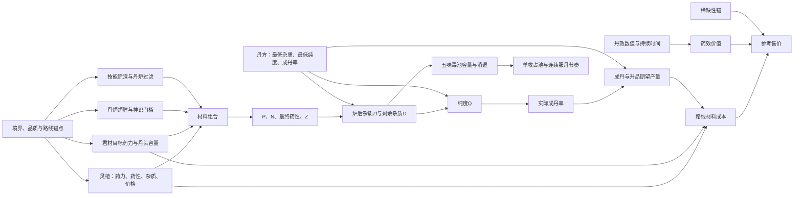

# 炼丹系统 · 第四步4.1字段归属与数值分层 · 验收稿 v0.1

**整理**：小G  
**日期**：2026-08-14  
**状态**：待用户验收  
**范围**：只确定数值字段的归属、分层、上游、生成阶段和校验用途，不确定具体数值，不进入4.2。

## 一、核对依据

- 《炼丹系统·第六版设计定稿》v6.10；
- 《炼丹系统·配置表字段与程序使用说明》v1.2；
- `E:\works\mortal-cultivation-war3\xlsx`当前工作簿的实际表头。

当前工作簿中的数值仍是示例或占位值，本稿不采用这些数值。

## 二、数值分层

| 层级 | 定义 | 保存位置 |
|---|---|---|
| 结构坐标 | 境界、品质、材位、五行、五味、成丹性值、来源类型等离散坐标 | 正式配置表 |
| 锚点 | 先确定的总体量级、目标和比例，不由某一行配置结果决定 | 第四步数值施工载体；确认后回写设计定稿 |
| 派生值 | 根据结构坐标、锚点和派生规则生成的候选值 | 正式配置表对应字段 |
| 校验指标 | 根据候选配置计算，用于判断数值是否成立 | 数值施工与验证结果，不写入运行配置 |
| 运行状态 | 玩家神识、五味绝对杂质、丹毒等实际状态 | 人物与丹药实例，不作为配置候选值 |
| 展示映射 | 把计算结果转换为文字 | 成丹率描述等展示配置 |

特殊丹药、特殊丹头、特殊炉型和经济例外，是对派生值的显式覆盖，不单独构成一层。

## 三、结构坐标与非数值字段

下列字段参与定位、引用或内容表达，但不进入第四步数值生成：

| 表 | 字段 |
|---|---|
| 灵植表 | `seq、id、name、realm、role、quality、element、taste` |
| 丹方表 | `id、recipe_id、pill_name、rule_name、function、realm、quality、jun_quality、element、taste、nval、enabled、head_id、jun_id、min_id、ast_id、env_id、action1..3、param1..3` |
| 丹炉表 | `seq、id、name、max_realm、quality、enabled` |
| 除渣力 | `seq、source_id、name、base_realm、source_type` |
| 丹毒池 | `seq、base_realm` |
| 成丹率描述 | `id、text` |
| 系统参数 | `ConfigID、ParamID` |
| 属性配置 | `config_id、name、role、parent_attr_modifier、tab、desc、is_show、is_show_tip` |

说明：丹方`nval`虽然是整数，但它是875个基础坐标中的−2～+2五档之一，不由数值生成器调整。灵植`nval`是材料数值，列入下一节。

## 四、数值字段归属与生命周期

### 4.1 灵植表

| 字段 | 唯一含义 | 层级 | 上游 | 初值阶段 | 反推或终调 | 校验用途 |
|---|---|---|---|---|---|---|
| `max_material_count` | 丹头允许投入的臣佐使总份数 | 派生值 | 常见组方份数、丹头品质和定位 | 4.4建立规则，4.8生成基准 | 第九至十一步按解分布回调 | `N/Nmax`、丹头覆盖、路线数量 |
| `nval` | 君材开炉药性或臣佐使单份药性，范围−4～+4 | 派生值 | 药性覆盖、材位和路线定位 | 4.4建立分布规则 | 第九、十步按配平和安全顺序回调 | 药性覆盖、易调性、安全顺序 |
| `power` | 君臣佐使单份药力 | 派生值 | 境界药力基准、品质系数、材位和路线定位 | 4.4建立规则，4.8生成基准 | 第九至十一步按份数分布回调 | `P/U`、份数、材料支配 |
| `dross` | 君臣佐使单份绝对杂质 | 派生值 | 单份药力、路线杂质密度、境界和品质比例 | 4.4建立规则，4.8生成基准 | 第九至十一步按纯度与触底分布回调 | `A/Zf`、纯度、丹毒、材料支配 |
| `target_power` | 君材对应境界与品质的目标药力 | 派生值 | 境界药力基准、品质系数 | 4.3确定基准，4.4生成 | 第九至十一步按组方份数回调 | `P/U`、丹头容量、死方率 |
| `price` | 材料或丹头价格 | 派生值 | 境界价格锚、品质、稀缺度和路线定位 | 4.8生成候选 | 第十四步按成本与路线收益终调 | 路线成本、利润、材料选择 |

材位有效性：

| 材位 | 有效数值字段 |
|---|---|
| 君 | `nval、power、dross、target_power、price` |
| 臣 | `nval、power、dross、price` |
| 佐 | `nval、power、dross、price` |
| 使 | `nval、power、dross、price` |
| 丹头 | `max_material_count、price` |

### 4.2 丹方表

| 字段 | 唯一含义 | 层级 | 上游 | 初值阶段 | 反推或终调 | 校验用途 |
|---|---|---|---|---|---|---|
| `jump_tier_prob` | 成丹成功后的固定升一品率，万分比 | 派生值 | 品质产量目标、成丹率、成本、药效价值和稀缺性 | 4.5建立规则，4.8生成候选 | 第十一、十四步联合回调 | 期望产量、直接炼高品与低品赌升品的收益比较 |
| `jun_num` | 默认方君材数量，固定1 | 规则常量 | 每炉一份君材 | 第十二步写入 | 不反推 | 必须为1 |
| `min_num` | 默认臣材份数 | 默认方搜索结果 | 已通过回调的正式候选配置 | 第十二步生成 | 默认方失败时回退对应数值层 | 药力、药性、丹头、纯度和安全顺序 |
| `ast_num` | 默认佐材份数 | 默认方搜索结果 | 已通过回调的正式候选配置 | 第十二步生成 | 同上 | 同上 |
| `env_num` | 默认使材份数 | 默认方搜索结果 | 已通过回调的正式候选配置 | 第十二步生成 | 同上 | 同上 |
| `min_purity` | 本品质行最低纯度，万分比 | 派生值 | 合法组合纯度分布、品质定位和丹药价值 | 4.5建立生成方法，4.8给初值 | 第十一步按全量分布反推 | 死方率、门槛可弥补性、纯度余量 |
| `base_rate` | 达到最低纯度时的基础成丹率 | 派生值 | 品质产出目标和合法纯度分布 | 4.5建立规则，4.8给初值 | 第十一步反推，十四步复核经济 | 期望产量、单枚期望成本 |
| `max_rate` | 纯度提升后的成丹率上限 | 派生值 | 品质产出目标和纯度奖励空间 | 4.5建立规则，4.8给初值 | 第十一步反推 | 纯度提升价值、期望产量 |
| `min_impurity` | 本品质行剩余杂质下限，绝对值 | 派生值 | 境界绝对量级、纯度上界和丹毒节奏 | 4.5建立规则，4.8给初值 | 第十一步按触底率反推 | 最低杂质触底率、纯度、`D/Cpool` |
| `spirit_requirement` | 单枚并炼所需神识，作为批次数量分母 | 派生值 | 境界、品质和批量产出目标 | 4.5建立规则，4.8给初值 | 第十一、十四步按产量回调 | 批次数量、材料消耗、利润 |
| `duration` | 本品质丹效持续秒数 | 派生值并允许人工覆盖 | 丹效类型、境界、品质和药效价值 | 第八步配置候选 | 第十三、十四步按玩法与价值终调 | 单枚药效价值、售价、自用节奏 |
| `value1` | 第一行为的效果数值或目标ID | 派生值并允许人工覆盖 | 行为合同、境界、品质和药效价值 | 第八步配置候选 | 第十三、十四步终调 | 药效价值和售价 |
| `value2` | 第二行为的效果数值或目标ID | 派生值并允许人工覆盖 | 同上 | 同上 | 同上 | 同上 |
| `value3` | 第三行为的效果数值或目标ID | 派生值并允许人工覆盖 | 同上 | 同上 | 同上 | 同上 |
| `reference_price` | 本品质丹药的系统参考售价 | 派生值 | 路线期望成本、药效价值和稀缺性 | 4.5建立规则，4.8生成算法候选 | 第十四步经济纸推终调 | 利润、升品套利、跨境经济 |

丹方的两种神识数值分开：

- `丹炉.spirit_requirement`：能否驱动该丹炉；
- `丹方.spirit_requirement`：单枚并炼所需神识，用于批次数量。

### 4.3 丹炉表

| 字段 | 唯一含义 | 层级 | 上游 | 初值阶段 | 反推或终调 | 校验用途 |
|---|---|---|---|---|---|---|
| `cold_min` | 炉膛承寒下限 | 派生值 | 炉型、品质和顺序约束目标 | 4.4建立规则，4.8生成候选 | 第九至十一步按安全顺序回调 | 安全顺序、炉型覆盖 |
| `heat_max` | 炉膛承热上限 | 派生值 | 炉型、品质和顺序约束目标 | 同上 | 同上 | 同上 |
| `spirit_requirement` | 驱动本炉所需当前神识 | 派生值 | 最高可炼境界、品质和设备定位 | 4.4建立规则，4.8生成候选 | 第九、十三步按使用节奏回调 | 丹炉准入和炉型成长 |
| `price` | 丹炉价格 | 派生值 | 设备价格锚、炉型、品质和稀缺性 | 4.8生成候选 | 第十四步终调 | 长期装备回报和经济门槛 |

丹炉过滤率唯一保存在除渣力表，不保存在丹炉表。

### 4.4 除渣力

| 字段 | 唯一含义 | 层级 | 上游 | 初值阶段 | 反推或终调 | 校验用途 |
|---|---|---|---|---|---|---|
| `remove1..6` | 技能针对凡、灵、玄、仙、神、道六品质的同境基础绝对除渣力 | 派生值 | 境界绝对量级、品质档差、技能成长目标 | 4.4建立规则，4.8生成候选 | 第十一步按`A/Zf`和触底率反推 | 技能价值、路线差异、最低杂质触底率 |
| `filter1..6` | 丹炉针对六品质的同境基础过滤率，万分比 | 派生值 | 炉型、品质档差和路线目标 | 4.4建立规则，4.8生成候选 | 第十一步按纯度分布反推 | 炉型差异、纯度、成丹率 |

三种除渣来源分别按自己的`source_id`和`base_realm`计算境界差：炼丹术、灵植术、丹炉互不共用基准境界。

### 4.5 丹毒池

| 字段 | 唯一含义 | 层级 | 上游 | 初值阶段 | 反推或终调 | 校验用途 |
|---|---|---|---|---|---|---|
| `blood_capacity` | 酸味对应血肉池容量 | 派生值 | 酸味典型单枚剩余杂质、目标连服枚数 | 4.5建立规则，4.8生成候选 | 第十一步按实际`D`分布反推 | `D/Cpool`、服丹节奏 |
| `mind_capacity` | 苦味对应心神池容量 | 派生值 | 苦味典型单枚剩余杂质、目标连服枚数 | 同上 | 同上 | 同上 |
| `dantian_capacity` | 甘味对应丹田池容量 | 派生值 | 甘味典型单枚剩余杂质、目标连服枚数 | 同上 | 同上 | 同上 |
| `meridian_capacity` | 辛味对应气脉池容量 | 派生值 | 辛味典型单枚剩余杂质、目标连服枚数 | 同上 | 同上 | 同上 |
| `bone_capacity` | 咸味对应骨底池容量 | 派生值 | 咸味典型单枚剩余杂质、目标连服枚数 | 同上 | 同上 | 同上 |
| `blood_daily_decay` | 血肉池每日消退率 | 派生值 | 池容量和目标恢复节奏 | 4.5建立规则，4.8生成候选 | 第十一步反推 | 每日消退点数和恢复周期 |
| `mind_daily_decay` | 心神池每日消退率 | 派生值 | 同上 | 同上 | 同上 | 同上 |
| `dantian_daily_decay` | 丹田池每日消退率 | 派生值 | 同上 | 同上 | 同上 | 同上 |
| `meridian_daily_decay` | 气脉池每日消退率 | 派生值 | 同上 | 同上 | 同上 | 同上 |
| `bone_daily_decay` | 骨底池每日消退率 | 派生值 | 同上 | 同上 | 同上 | 同上 |

丹毒池按八个角色境界配置；炼气不开炼丹，不影响炼气角色服丹和保存丹毒状态。

### 4.6 成丹率描述

| 字段 | 唯一含义 | 层级 | 上游 | 确定阶段 | 校验用途 |
|---|---|---|---|---|---|
| `min_rate` | 前台文字区间下界 | 展示映射 | 实际成丹率分布和交互文案 | 第十三步 | 区间不重叠 |
| `max_rate` | 前台文字区间上界 | 展示映射 | 实际成丹率分布和交互文案 | 第十三步 | 覆盖需要显示的正成丹率 |

成丹率描述不参与成丹率计算，也不作为成丹率设计锚点。

### 4.7 系统参数

| 参数 | 唯一含义 | 层级 | 上游 | 初值阶段 | 反推或终调 | 校验用途 |
|---|---|---|---|---|---|---|
| `参数_低境界炼丹` | 三种除渣来源高境回炼低境丹的逐境倍率`K` | 派生校准参数 | 跨境收益边界 | 4.3、4.4生成候选 | 第十一步按跨境切片反推 | 高境成长与低境经济 |
| `参数_炼丹术熟练` | 炼丹术每1%熟练度增加的除渣比例 | 派生校准参数 | 炼丹术成长目标和`A/Zf`区间 | 4.4生成候选 | 第十一步反推 | 熟练成长、触底率 |
| `参数_灵植术熟练` | 灵植术每1%熟练度增加的除渣比例 | 派生校准参数 | 灵植术成长目标和`A/Zf`区间 | 4.4生成候选 | 第十一步反推 | 熟练成长、触底率 |
| `参数_效果减半丹毒` | 服药前达到该丹毒后本枚效果减半 | 锚点 | 目标服丹节奏 | 4.2定义，4.3定值 | 第十三步玩法纸推复核 | 减效区间和连续服丹节奏 |

固定禁服线10000属于规则，不配置数值字段。

### 4.8 属性接口与运行状态

| 属性 | 性质 | 数值来源 | 炼丹用途 |
|---|---|---|---|
| 血肉杂质、心神杂质、丹田杂质、气脉杂质、骨底杂质 | 运行状态 | 服丹增加、每日消退 | 保存五味当前绝对杂质`I` |
| 血肉丹毒、心神丹毒、丹田丹毒、气脉丹毒、骨底丹毒 | 运行派生状态 | `I / 当前境界对应池容量` | 减半与禁服判定 |
| 神识 | 外部输入 | 人物数值成长 | 丹炉准入和批次数量 |
| 虚弱及其他丹效目标属性 | 外部接口 | 属性、BUFF和技能系统 | 供丹方`action/param/value`操作 |

属性配置表只定义接口，不承担炼丹数值锚点或候选值。

## 五、生成器专用锚点

以下锚点不属于任何运行配置行。第四步保存候选版本，确认后将数值原则回写设计定稿。

| 锚点 | 决定的下游数值 |
|---|---|
| 七个可炼境界的绝对量级基准 | 药力、绝对杂质、绝对除渣、最低杂质、毒池、药效 |
| 六品质系数 | 同境品质间的目标药力、材料、除渣、概率、药效和价格档差 |
| 省位、洁净、易调性、低成本四条路线目标 | 灵植药力、药性、杂质密度和价格分布 |
| 常见臣佐使份数目标 | 材料药力带、君材目标药力、丹头容量 |
| 毒池目标连服枚数与恢复节奏 | 五味容量、每日消退率、效果减半线 |
| 同境与跨境回炼收益边界 | 低境界炼丹倍率、跨境成本和收益 |
| 境界与品质价格锚 | 材料、丹头、丹炉基础价格 |
| 药效价值与稀缺性锚 | 丹效数值、持续时间、参考售价和升品收益 |
| 成本、药效价值、稀缺性售价权重 | 丹药参考售价 |

## 六、校验指标归属

| 指标 | 输入字段 | 用途 |
|---|---|---|
| `P/U` | 材料`power`、君材`target_power` | 药力余量和药力带 |
| `N/Nmax` | 配方份数、丹头`max_material_count` | 容量压力和省位路线 |
| `A/Zf` | 技能`remove`、丹炉`filter`、材料`dross` | 除渣量级和触底风险 |
| `Q−Qmin` | 实际纯度、`min_purity` | 纯度余量和成丹率增益空间 |
| `D/Cpool` | 实际剩余杂质、对应味`capacity` | 单枚丹毒负担 |
| 死方率、有效解数量 | 全量材料与丹方条件 | 数学可行性 |
| 代表路线数量 | 省位、洁净、易调性、低成本代表解 | 多路线是否成立 |
| 最低杂质触底率 | 实际剩余杂质、`min_impurity` | 材料与除渣选择是否失效 |
| 支配材料数量 | 同池材料`power、nval、dross、price` | 要求全面支配为0 |
| 丹头与炉型覆盖率 | 容量、炉膛和安全顺序 | 设备定位 |
| 期望产量 | `base_rate、max_rate、jump_tier_prob` | 品质供给 |
| 单枚期望成本 | 材料价格、失败率和期望产量 | 路线经济 |
| 参考售价与利润 | 期望成本、药效价值、稀缺性 | 自用、出售与套利 |
| 跨境收益变化 | 三种除渣来源境界差、成本与产量 | 成长价值和低境经济 |

校验指标只读取候选配置，不写回正式配置字段。

## 七、跨表数值关系



## 八、旧数值隔离清单

| 位置 | 旧内容 | 本步处理 |
|---|---|---|
| `L灵植表.xlsx / 计算用` | 药滓乘数、`P≤U`、材料相激、炉压、旧纯度和旧丹毒公式 | 不读取、不引用；后续从当前工作簿移出 |
| `L灵植表.xlsx / 灵植数值表` | `dross_rate`、`capacity/承载上限U`等旧字段 | 不读取、不引用；后续从当前工作簿移出 |
| `D丹方丹效表.xlsx / 丹毒参数` | `gain_div、bucket、half_at、block_at、decay_value、price_base、price_slope`等旧口径 | 不读取、不引用；后续从当前工作簿删除，历史文件保留归档 |

当前数值生成器只读取：灵植表、丹方表、丹炉表、除渣力、丹毒池、系统参数中的四项炼丹参数，以及属性接口定义。

## 九、计算载体方案

建议建立一个非运行工作簿：

```text
炼丹系统_第六版_数值生成与验证_v0.1.xlsx
```

建议页签：

| 页签 | 保存内容 |
|---|---|
| 字段矩阵 | 本稿确认后的数值字段归属和生命周期 |
| 锚点 | 4.2、4.3确认的玩法、经济、境界和品质锚点 |
| 派生规则 | 4.4、4.5确认的公式、取整、上下限和覆盖条件 |
| 最小试算 | 4.7的输入、中间值和标准结果 |
| 生成参数 | 4.8提供给第五至第八步的区间、档位和生成参数 |
| 校验结果 | 4.6判据以及后续切片、组合和经济结果 |
| 版本记录 | 锚点、规则、候选值和回调范围的版本变化 |

设计定稿保存正式数值原则和公式；正式配置表保存游戏实际使用的数值；计算工作簿保存候选值、推导过程和验证结果。

## 十、4.1验收项

请确认：

1. 数值字段是否列全，唯一含义是否正确；
2. 锚点、派生值、运行状态和展示映射的分层是否正确；
3. 每个派生字段的上游、初值阶段、反推阶段和校验用途是否正确；
4. 跨表数值关系是否完整；
5. 旧数值隔离清单是否正确；
6. 是否采用第九节的非运行数值生成与验证工作簿方案。

本稿经用户验收后，进入4.2确定玩法与经济锚点的定义。
